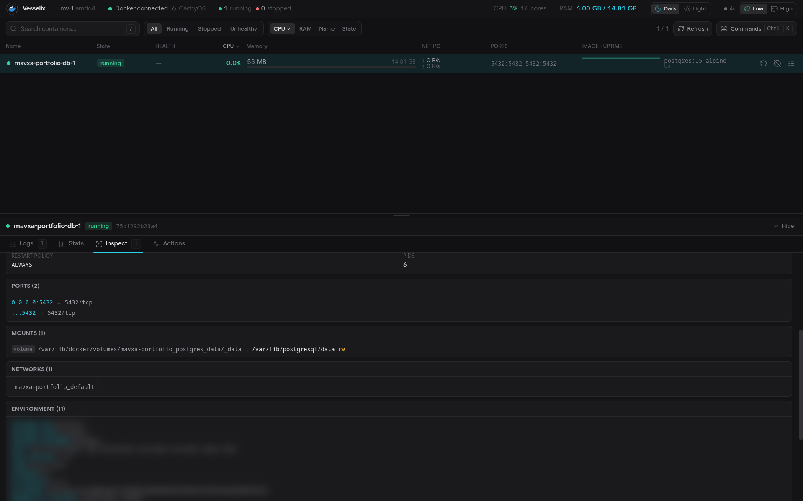
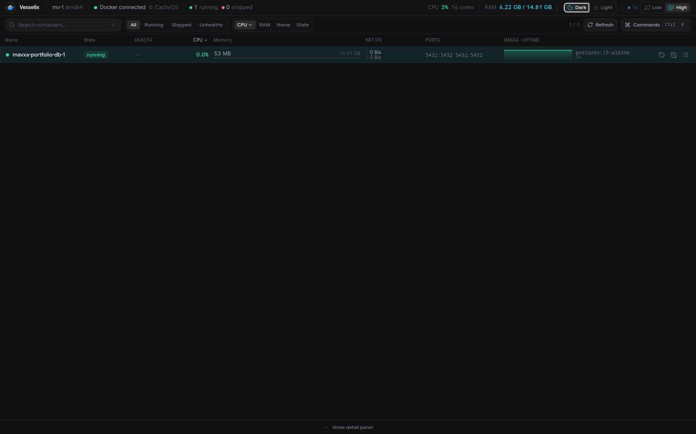
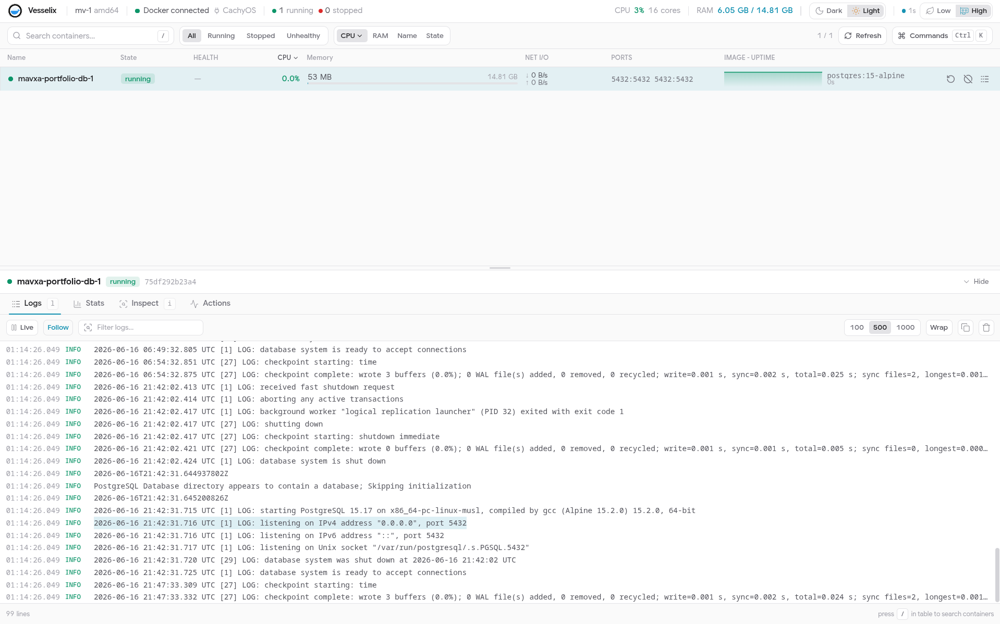
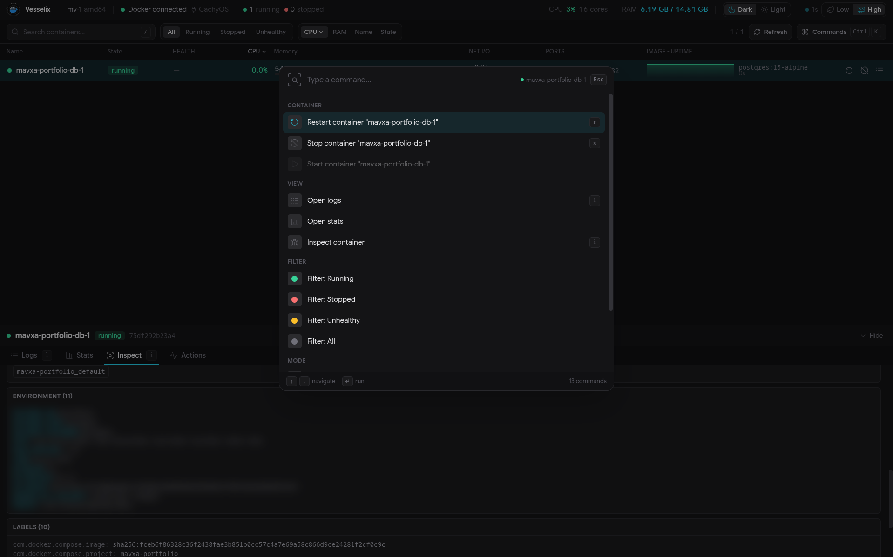
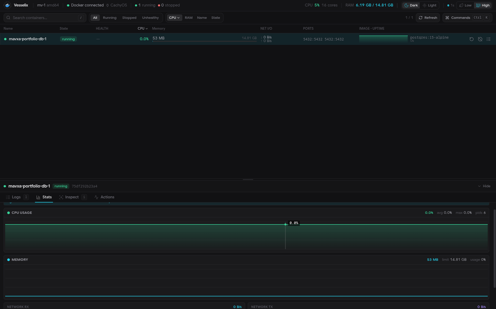

# Vesselix

Vesselix is a lightweight local-first Docker dashboard: `docker ps` + `docker logs` + `docker stats` + command palette.

It is designed as a compact system tool, not a PaaS or admin suite. Vesselix runs locally, talks to the Docker socket, and serves the UI from a single Rust binary with the frontend embedded.

## Install

<details open>
<summary><b>Linux install script</b></summary>

Install the latest GitHub Release:

```sh
curl -fsSL https://raw.githubusercontent.com/mavxa/Vesselix/main/install.sh | sh
```

Install a specific version:

```sh
curl -fsSL https://raw.githubusercontent.com/mavxa/Vesselix/main/install.sh | VERSION=v0.1.1 sh
```

Install without `sudo` into a user directory:

```sh
curl -fsSL https://raw.githubusercontent.com/mavxa/Vesselix/main/install.sh | INSTALL_DIR="$HOME/.local/bin" sh
```

The installer:

- detects `x86_64`, `aarch64`, and `armv7h`
- downloads the matching Linux release archive
- verifies the release checksum
- installs only the `vesselix` binary
- does not enable autostart

</details>

<details>
<summary><b>Arch Linux / AUR</b></summary>

Prebuilt binary package:

```sh
paru -S vesselix-bin
```

Build from the latest git source:

```sh
paru -S vesselix-git
```

Run it:

```sh
vesselix
```

The AUR packages install a systemd unit but do not enable it automatically:

```sh
sudo systemctl enable --now vesselix.service
```

</details>

<details>
<summary><b>Docker / GHCR</b></summary>

Run Vesselix as a container:

```sh
docker run --rm \
  -p 127.0.0.1:4747:4747 \
  -v /var/run/docker.sock:/var/run/docker.sock \
  ghcr.io/mavxa/vesselix:latest
```

Run a specific release:

```sh
docker run --rm \
  -p 127.0.0.1:4747:4747 \
  -v /var/run/docker.sock:/var/run/docker.sock \
  ghcr.io/mavxa/vesselix:v0.1.1
```

Open:

```text
http://127.0.0.1:4747
```

The container must mount the Docker socket to inspect and control local containers. Keep the host-side port bound to `127.0.0.1` unless you intentionally want LAN access.

</details>

<details>
<summary><b>Manual GitHub Release</b></summary>

Download the archive for your platform from GitHub Releases:

```text
vesselix-v0.1.1-linux-x86_64.tar.gz
vesselix-v0.1.1-linux-aarch64.tar.gz
vesselix-v0.1.1-linux-armv7h.tar.gz
vesselix-v0.1.1-windows-x86_64.zip
```

Linux example:

```sh
tar -xzf vesselix-v0.1.1-linux-x86_64.tar.gz
sudo install -m 755 vesselix /usr/local/bin/vesselix
```

Optional checksum verification:

```sh
sha256sum vesselix-v0.1.1-linux-x86_64.tar.gz
```

Compare it with the matching `.sha256` file from the same release.

</details>

<details>
<summary><b>Windows</b></summary>

Download `vesselix-v0.1.1-windows-x86_64.zip` from GitHub Releases, extract it, and run:

```powershell
.\vesselix.exe
```

Docker Desktop must be running if you want Vesselix to talk to Docker on Windows.

</details>

## Run

<details open>
<summary><b>CLI</b></summary>

Start on the default local address:

```sh
vesselix
```

Default address:

```text
http://127.0.0.1:4747
```

Use a custom port:

```sh
vesselix -p 33557
```

Listen on all interfaces:

```sh
vesselix --host 0.0.0.0 --port 4747
```

Environment overrides:

```sh
VESSELIX_HOST=127.0.0.1 VESSELIX_PORT=4747 vesselix
```

</details>

<details>
<summary><b>Systemd</b></summary>

The AUR package installs `vesselix.service`:

```sh
sudo systemctl enable --now vesselix.service
```

Check logs:

```sh
journalctl -u vesselix.service -f
```

Override the port or host with a systemd override:

```sh
sudo systemctl edit vesselix.service
```

Example override:

```ini
[Service]
ExecStart=
ExecStart=/usr/bin/vesselix --host 127.0.0.1 --port 33557
```

</details>

## Preview

<details open>
<summary><b>Screenshots</b></summary>







Screenshots live in `docs/assets/screenshots/`, not `public/`.

`public/` is copied into the frontend build and embedded into the release binary, so large screenshots there would make every Vesselix binary larger. README images can reference files from `docs/assets/screenshots/` directly.

</details>

## Features

<details open>
<summary><b>Current features</b></summary>

- Local-first Docker dashboard served from one binary.
- Compact dark-first interface for daily container work.
- Container table with state, health, CPU, memory, network, ports, image, uptime, and actions.
- Virtualized logs with tail limit, pause/resume, follow, search, wrap, copy, and clear view.
- Low mode for weak hardware with slower polling and minimal animation.
- High mode with richer selected-container stats and lazy-loaded chart code.
- Command palette and keyboard-first navigation.
- Start, stop, restart, kill, pause, unpause, and remove actions.
- Real host CPU/RAM metrics including processes outside containers.
- API and mock runtime adapters so preview/marketing builds can run without Docker.

</details>

<details>
<summary><b>Planned / possible later</b></summary>

- WebSocket or SSE log tailing instead of REST polling.
- Real CPU/RAM/network history instead of placeholder series.
- Podman, nerdctl, or containerd provider support behind a backend runtime abstraction.
- Debian `.deb` packages for Raspberry Pi OS, Ubuntu, Debian, and Armbian.
- Scoop or winget manifests for Windows.
- Optional config file for service defaults.

</details>

## Security

<details open>
<summary><b>Docker socket access</b></summary>

Vesselix needs access to the Docker API. On Linux this usually means `/var/run/docker.sock` or membership in the `docker` group.

Docker socket access is powerful. Anyone who can control Docker can effectively control the host. Vesselix therefore binds to `127.0.0.1:4747` by default.

Only use LAN binding if you understand the risk:

```sh
vesselix --host 0.0.0.0 --port 4747
```

</details>

## Development

<details>
<summary><b>Run from the repo</b></summary>

Run the Rust backend/API:

```sh
bun run dev:backend
```

Run the Vite frontend:

```sh
bun run dev
```

The Vite dev server proxies `/api` to `http://127.0.0.1:4747`.

</details>

<details>
<summary><b>Checks</b></summary>

Frontend:

```sh
bun run lint
bun run build
```

Backend:

```sh
cargo fmt --manifest-path backend/Cargo.toml --check
cargo check --manifest-path backend/Cargo.toml
```

Release binary smoke test:

```sh
bun run build
cargo build --release --manifest-path backend/Cargo.toml
backend/target/release/vesselix -p 4747
```

</details>

<details>
<summary><b>Packaging</b></summary>

Release archives are built by `.github/workflows/release.yml` when a `v*` tag is pushed.

Docker images are built by `.github/workflows/docker.yml` and published to:

```text
ghcr.io/mavxa/vesselix
```

AUR publishing is manual through `.github/workflows/aur.yml`. For `vesselix-bin`, the workflow updates checksums from the GitHub Release before pushing to AUR.

Local AUR checksum update:

```sh
./scripts/update-aur-bin.sh v0.1.1
```

</details>

## References

<details>
<summary><b>Links</b></summary>

- GitHub Releases: https://github.com/mavxa/Vesselix/releases
- AUR `vesselix-bin`: https://aur.archlinux.org/packages/vesselix-bin
- AUR `vesselix-git`: https://aur.archlinux.org/packages/vesselix-git
- Docker image: https://github.com/mavxa/Vesselix/pkgs/container/vesselix

</details>
